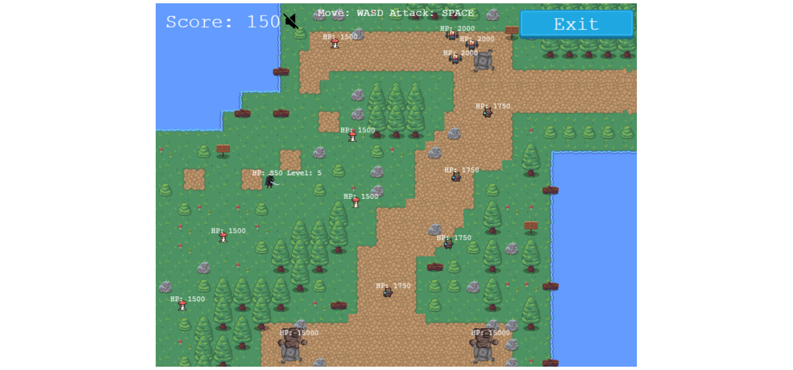

# Little Tale RPG

## Description

This is a JavaScript capstone project from Microverse curriculum. It is a real time RPG. It is built based on next features:
1. The player can control the main character on the map;
2. The main goal is to kill monsters using that character;
3. By killing monsters main character gains experience;
4. Based on experience main char level is increasing using next formula: `Math.round(((Math.sqrt(25 + 10 * experience) - 5) / 10))`;
5. Main char has states like: attack, hp, experience, attack radius which can change if the main char is increasing the level;
6. Monsters on the map are moving randomly and randomly time;
7. Each monster has its own states like: hp, attack, experience for killing, attack radius;
8. Monsters are powerful so player has to control the distance between himslef and  monsters;
9. Monsters attacks the player if he is not far;
10. The experience of the player is stored in an API;
11. There is a leaderboard where players can compete gaining experience from killing monsters;
12. The game can be finished in 3 ways: main char death, killing all monsters, restart etc.

P.S. Wanna mention that the battle system was fully implemented by me.

## Built With

- [Phaser 3](https://phaser.io/phaser3)
- JavaScript
- Webpack
- Jest
- API for storing scores

## Set up this projecect locally

- Open the terminal in the directory where you want to install the app;
- Run command `git clone git@github.com:iliebabcenco/littletale-rpg.git` which will clone the project;
- Switch to the main directory of project using cd;
- Run `npm install webpack webpack-cli --save-dev` in your computer terminal to install Webpack (you will need Node.js installed on your machine);
- Open index.html file in your browser using a code editor like [VSCode](https://code.visualstudio.com/);
- Use it.

## How it looks

| Desktop version                    |
| ---------------------------------- |
|  |
|  |
|  |
|  |
|  |

### Deployment

The game is deployed on [Netlify](https://little-tale-rpg.netlify.app/) also on [GitHubPages](https://iliebabcenco.github.io/littletale-rpg/).

## Authors

👤 **Ilie Babcenco**

  

## 🤝 Contributing

Contributions, issues, and feature requests are welcome!

If you want to contribute, you can clone this project or fork it.

If you found an issue, feel free to check the [issues page](https://github.com/iliebabcenco/littletale-rpg/issues).

## Show your support

Give a ⭐️ if you like this project!

## Acknowledgments

- [Microverse](https://www.microverse.org/)
